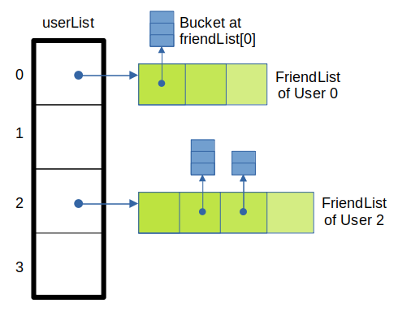
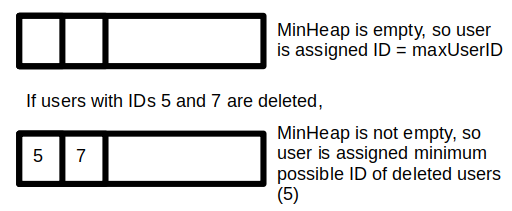
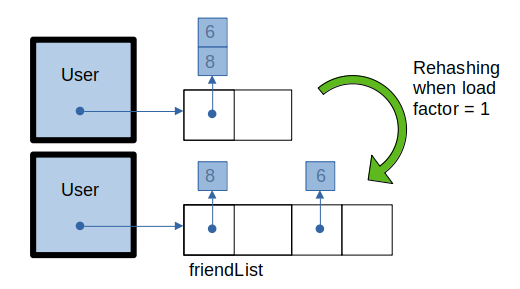
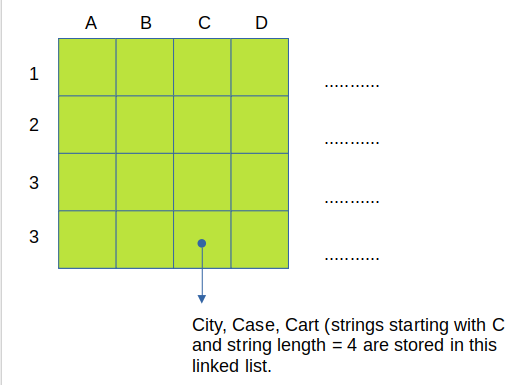
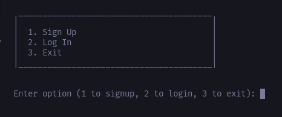
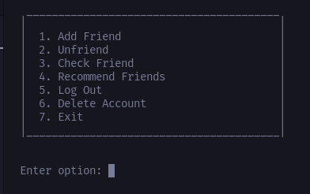

# Friends Recommendation System

This is the GitHub repository for Team 20, whose members have been assigned the project "Friends Recommendation System". 

The members of Team 20 are: 

* Jay Ghevariya
* Konduru Nithin
* Syed Imami
* Yashwanth Kottu
* Arjun Muraleedharan

<hr>

## Structure

The network is implemented as a graph. The graph is in turn implemented as an adjacency list, but with several modifications. The structure of the graph is an array, userList of hash tables (friendList). Each element of userList is a pointer to a struct User, containing the details of the User. Each struct User contains a pointer to an array of Node pointers, which is the friendList of that User. Each Node pointer represents a bucket and points to a linked list (separate chaining). The friendList contains only the IDs of the friends, which can be used to reference them if needed.

<br>
<p align="center">

</p>
<br>

A minHeap has been included in the graph, which stores the IDs of the users deleted. This is done to minimize the time taken for user deletion, as we don't have to shift the elements of the array and change existing user IDs. We merely reserve the deleted ID for the next user to register. The next user to register would get the minimum of all the deleted IDs, which is why we use a minHeap.

<br>
<p align="center">

</p>
<br>

<hr>

## Working

Hashing is used to optimise the time taken for operations. Searching for a user in the userList of the graph can be done in O(1) time, as the array provides random access. Since the number of users are not known beforehand, we allocate a dynamic array of size 2, and double the size, reallocating elements every time the array is full. We follow the same procedure for the minHeap.

Each user starts off with a friendList of size 2, since again, the number of friends a user can have is not known beforehand. We again use a dynamic array here. However, random access does not help us here, as the friends' IDs are not placed in the corresponding indices, to conserve memory and time. 

Instead, we use separate chaining. Each element of the dynamic array is a bucket containing a few of the friends of the user. When the load factor becomes 1, we perform rehashing, doubling the table size.

<br>
<p align="center">

</p>
<br>

1. When we <strong>ADD A USER</strong>, we first check the minHeap to see if the ID of any previously deleted user is available or not. If heapSize = 0 (minHeap is empty), we assign the user ```G->maxUserID + 1``` as their ID. If not, we assign the user ```G->minHeap[0]```, the minimum ID in the heap. In this way, we guarantee that the user gets the minimum possible ID, while utilising left over space. An average of O(1) time is taken to add the user while O(log n) time is taken to maintain the heap property.

2. When we <strong>DELETE A USER</strong>, we free the memory associated with the user and insert their ID into the minHeap, so that any future users can be assigned that ID. We also delete the user from the friendLists of all the other users who have added that user as a friend. Deletion takes O(1) time, insertion of ID into the minHeap takes O(log n) time and removal of user from friendList of all users (```removefriendofuser()```) takes at worst O(n) time.

3. The functions <strong>ADDFRIEND()</strong>, <strong>REMOVEFRIEND()</strong> and <strong>ISFRIEND()</strong> have been implemented using hashing. First, we find the corresponding bucket number of the ID in the friendList. We then traverse through the linked list at friendList[bucket_number], searching for the ID. This has a time complexity of ```O(1)``` in the average case, and ```O(n)``` in the worst case. However, we insert at the beginning of the linked list, making insertion truly ```O(1)```.

<hr>

## <strong>Friends Recommendation</strong>

There are two different recommendation algorithms we have used here:

1. For already existing users (those who have friends)
2. For newly registered users (those with no friends)

For <strong>EXISTING USERS</strong> with friends, our algorithm is based on recommending friends of friends of the user, friends of those friends and so on. In order to achieve this in the fastest time possible, we perform <strong>Breadth-First Traversal</strong> starting from the user.The user is recommended K new friends in this way (K is an input given by the user).

The time complexity of this algorithm is ```O(n + f)``` where n is the total number of users and f is the average number of friends of each user. However, this is not accounting for the fact that only K users are recommended. In that case, time complexity is ```O(k)```.

For <strong>NEW USERS</strong> without friends, our algorithm is based on <strong>grouping users with common parameters together</strong>. We use the idea of hash tables to divide users into buckets and access them quicker. We have an integer hash table (IntHashtable) for age, and 2 string hash table (StringHashtable) for city and school. 

* IntHashtable consists of a 1D array of linked lists. The linked list at the i-th position contains the IDs of users for which i = age % 100. 

<br>
<p align="center">

</p>
<br>

* StringHashtable consists of a 2D array of linked lists. The linked list at i, j contains the strings of length i + 1 and starting with the j-th letter of the alphabet. 

Whenever a new user is registered, they are inserted into the corresponding hash tables depending on their parameters. 

Let `nA` be the number of users of the same age as the user, `nC` be the number of users in the same city as the user and `nS` be the number of users who went to the same school as the user.

The time complexity of this algorithm is ```O(nA + nC + nS)```, which is linear, but is considerably less than ```O(n)```, where n is the total number of users. ```O(n)``` is the worst-case complexity, but this only happens when every user has at least one common parameter with the new user, which is usually an unlikely case.

<hr>

## Data Structures Used

* Graphs

* Arrays (1D and 2D arrays)

* Heaps (MinHeap, MaxHeap and Priority Queue) 

* Queues

* Hash Tables

* Singly Linked Lists

<hr>

## Division of Tasks

* <strong>KONDURU NITHIN</strong> - RemoveUser(), NewFriends() algorithm - Grouping

* <strong>SYED IMAMI</strong> - AddFriend(), RemoveUser(), removefriendfromuser()

* <strong>YASHWANTH KOTTU</strong> - AddUser(), NewFriends() algorithm - Grouping

* <strong>JAY GHEVARIYA</strong> - IsFriend(), NewFriends() algorithm - Hash tables

* <strong>ARJUN MURALEEDHARAN</strong> - User Interface, ADTs, Friendship Recommendation implementation

<hr>

## Setup

No additional software/library is required to run the application. 

1. Clone the repository using the following command.

`git clone https://github.com/coniferousdyer/Friends-Recommendation-System.git`

2. Now enter the following commands to enter the cloned repository on your system.

`cd Friends-Recommendation-System/src`

3. Enter the following command to compile the application.

`gcc *.c`

4. Finally, run the program.

`./a.out`

<hr>

## Instructions

<br>
<p align="center">

</p>
<br>

When the program starts, you will be greeted by the title of the social network, followed by a Signup/Login Menu. Signup is for new users, while Login is for existing users. You will be prompted to enter details and then you will be able to see the main menu, where you can access 7 options: `Add Friends`, `Unfriend`, `Check Friend`, `Recommend Friends`, `Log Out`, `Delete Account` and `Exit`. Enter the corresponding number to pick the option.

<br>
<p align="center">

</p>
<br>

<strong>NOTE 1: </strong> After you signup, if there are any existing users in the system, you will be recommended to add them as friends.

<strong>NOTE 2: </strong> After picking Recomend Friends/being recommended friends after signing up, if you enter a character other than an integer, the IDs you entered will be added as friends.

<hr>

<em>The Friends-Recommendation-System was developed as part of the final project of the Data Structures and Algorithms course, IIIT Hyderabad, by Professor Ravi Kiran S and Professor Sujit Gujar.</em>


